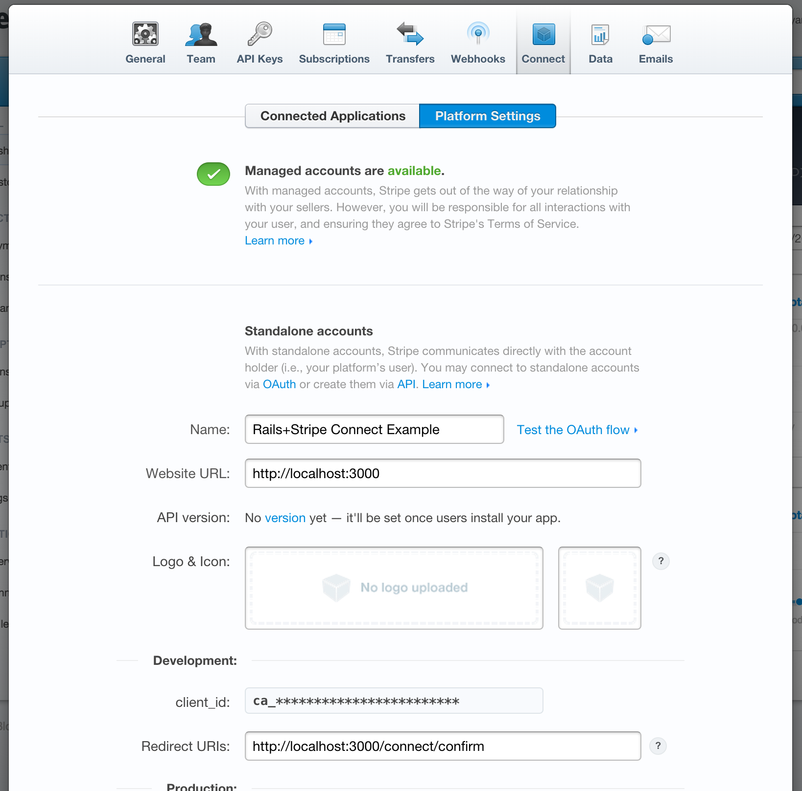
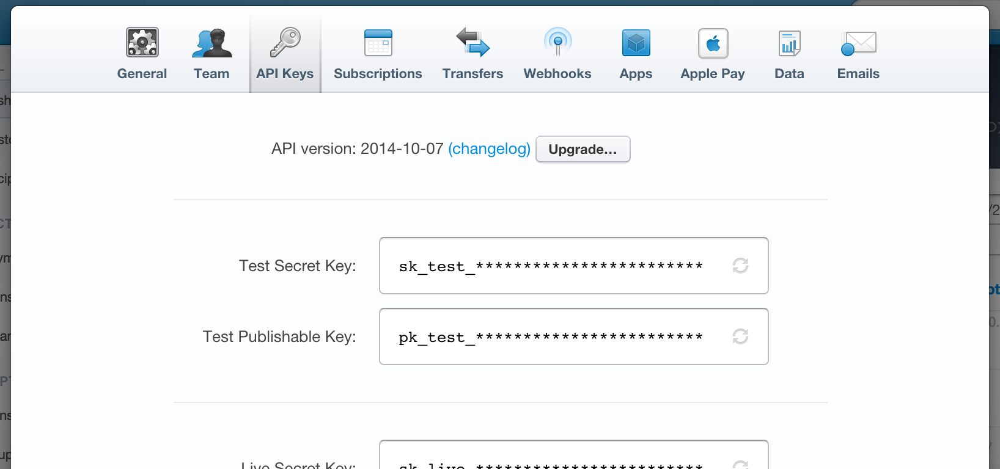

# Rails + Stripe Connect Example Application

First things first: this repository is a 1:1 port from https://github.com/rfunduk/rails-stripe-connect-example. I have updated the application to work for Rails 5.0.2.

This repository contains a bare-bones example Stripe Connect application.
It's purpose is to demonstrate the various pieces needed to get up and
running with your own application.

**This application is not meant to be used as a starting point or run in production**!

## Pre-requisites

This application currently uses the following Stripe API version: [**2017-04-06**](https://stripe.com/docs/upgrades#2017-04-06)

This application is based on **Rails 5.0.2** and running on **Ruby 2.4** (with
[`bundler`](http://bundler.io/)).

You need a Stripe account configured with a Connect application.
That can be setup in your [Account Settings under 'Apps'](https://dashboard.stripe.com/account/applications/settings).
Here's what it should look like configured:

Note the 'Redirect URIs' setting.

You'll also need the regular API keys for the same account, which
you can also get in [Account Settings under 'API Keys'](https://dashboard.stripe.com/account/apikeys).

## Setup

To get started, first clone this repo and install dependencies:

    git clone git@github.com:nickvanderwildt/stripe-connect.git
    cd stripe-connect
    bundle install

Next we need to run the setup script that will put your various Stripe
credentials in the appropriate place. Since this will be asking for API
keys, you probably want to [read it over](./lib/tasks/setup.rake) first
to be confident nothing nefarious is being done with your API keys :)

    rails app:setup

Once you get through that, your keys will be in `config/secrets.yml` and
picked up by Rails when you start it.

Now load the schema into the database:

    rails db:schema:load

And start up the server:

    rails s

Then as usual visit [http://localhost:3000](http://localhost:3000) in your
browser of choice.

### Webhooks

Optionally, if you want webhooks to work, signup for [ngrok](https://ngrok.com)
(and donate!). Then run:

    ngrok -authtoken=NGROK_TOKEN -subdomain=a-name 3000

Then configure your Stripe Connect application's 'Webhook URL' on the
[application settings page](https://dashboard.stripe.com/account/applications/settings)
to be `http://a-name.ngrok.com/hooks/stripe`.

The `account.application.deauthorized` webhook will do the right
things, but to see others you'll want to just look at the Rails request log.

## How It Works

### Step 0

If you want to try out a subscription with Stripe Connect,
[add some plans](https://dashboard.stripe.com/test/plans)
to your application's account on the dashboard.

### Step 1

Visit the app and click 'Get Started'. You'll be prompted to
create a user account. This app has a basic user login/cookie-based
session system.

### Step 2

Connect to Stripe. You'll have the option of 3 different types
of connection:

##### 1. OAuth Standalone

Create an account or connect to an existing account via an OAuth flow.
You may want to do this in an incognito window or similar so that you don't
accidentally connect your platform/main account to itself which will be
very confusing.
It's probably best to make another Stripe account with a test email
address (eg, with Gmail you can do things like `you+stripetest1@gmail.com`
to make this easier), or you can just use the 'Create New Account...'
option in the menu at the top right of your Stripe dashboard.
When you click 'Connect', look for the development mode bar
at the top of the page:

...and click _Skip this account form..._ if you aren't activated yet.

This account + Stripe connection becomes the 'seller'.

##### 2. Standalone Account via API

You can create a standalone Stripe account via the API, which doesn't require
the user to leave your site at all.
Doing this is a simple matter of choosing a country and clicking 'Create'
This account + Stripe connection becomes the 'seller'.

##### 3. Managed Account via API

You can create an entirely managed-by-you Stripe account via the API.
With this method the user will have the least interaction with Stripe.
Doing this is a simple matter of choosing a country, agreeing to the Stripe
Terms of Service, and clicking 'Create'.
Currently managed accounts are in beta and only available to US or Canadian
platform accounts.
This account + Stripe connection becomes the 'seller'.

### Step 3

Now log out of the example app and signup again for another account.
This time don't bother connecting to Stripe (although you can if you want).
This account becomes the 'buyer'.

### Step 4

Purchase something from the seller as the buyer! Visit
[http://localhost:3000/users](http://localhost:3000/users) and
choose the connected/seller account. And make a payment or
subscribe to a plan.

### Step 5

Go through the code! I've tried to heavily comment the relevant and most
important parts of the code. Let me know if anything is unclear or
broken by opening an issue or [sending me an email](http://ryanfunduk.com).
I suggest perusing [the Connect docs](https://stripe.com/docs/connect) before
trying to dig into the code.
